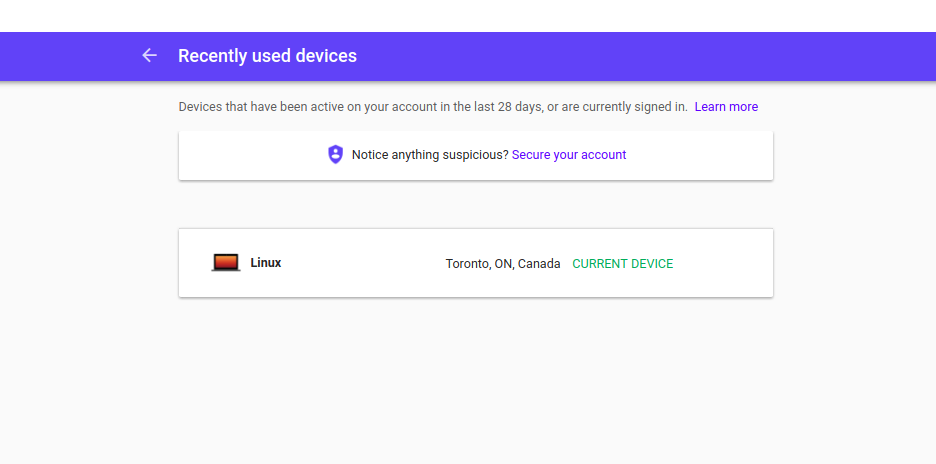
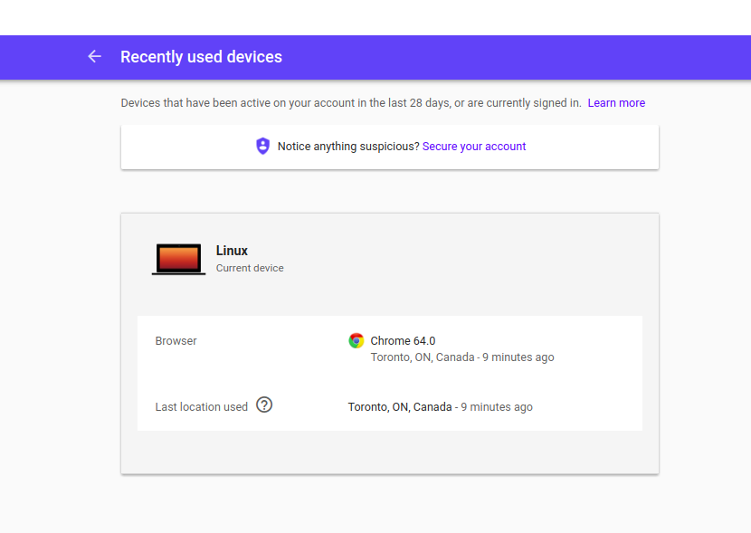
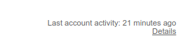
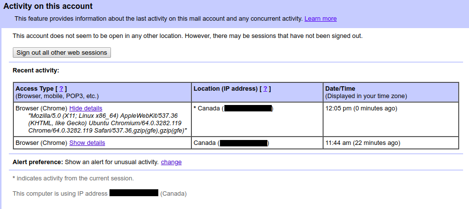
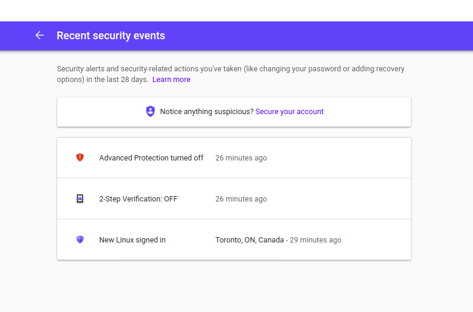
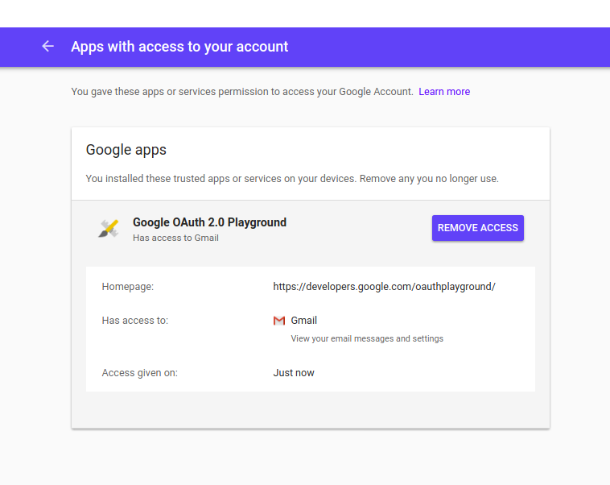
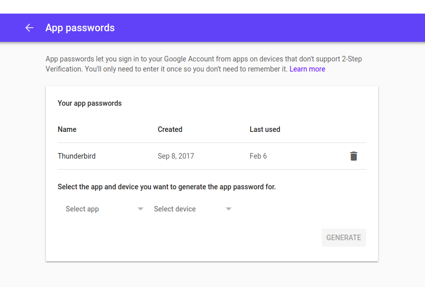
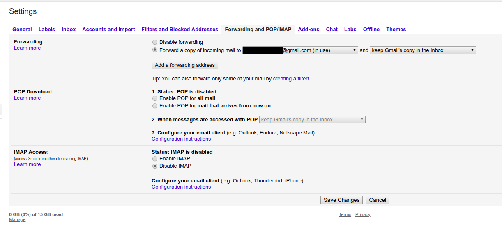

# Forensic/Security test on a Gmail account

In some cases, you may have a hint that someone has accessed your Gmail account. This short guide aims at helping you checking security parameters in your Google account to be sure that you are the only one having access to it, and that no parameter has been changed to allow an external attacker to keep access to this account.

**This is not a security guide**. If you actually need to secure your Googlke account, please check [Security Planner](https://securityplanner.org/) or [Net Alert](https://netalert.me/secure-accounts.html). The first action to improve your security should be to set up [2 Factor Authentication](https://securityplanner.org/#/tool/2-factor-authentication).

**This guide was written in February 2018 and not updated since**, it may not be fully relevant when you will read it. Please double check any information contained in this guide. Feel free to open an [issue](https://github.com/Te-k/how-to-quick-forensic/issues) if you see any problem in this guide.

## Summary

* **Last Activity** : check [this page](https://myaccount.google.com/device-activity) quickly, but mainly focus on the connections you can see when clicking on "Details" in the bottom right on your Gmail inbox.
* **Review Security Events** : check [this page](https://myaccount.google.com/notifications) for anything suspicious
* **OAuth Apps** : look for any suspicious app on [this page](https://myaccount.google.com/permissions)
* **App passwords** : look any app password on [this page](https://myaccount.google.com/apppasswords)
* **Recovery email and phone** : check what recovery [email](https://myaccount.google.com/recovery/email) and [phone number](https://myaccount.google.com/signinoptions/rescuephone) are configured for the account
* **Auto-Forwarding** : check [this page](https://mail.google.com/mail/#settings/fwdandpop) and remove any email address you do not own or trust (emails can be forwarded to these addresses through filters even if disabled here). Check that IMAP and POP are disabled if you do not need them.

## Last Activity

There are two ways to check for your recent activity in Google. The first one is to check the list of devices recently used, it is incomplete but a good start. Go to this page : https://myaccount.google.com/device-activity

You can see here all the devices used recently :

If you click on any device, you can see the last activity and the software used. For other devices than the one you are using, you can disconnect them:

It is interesting but not showing detailed information. The get more in depth information, you need to go on your [Inbox](https://mail.google.com/mail/#inbox) and click on "Details" at the complete bottom right of the page :

This page gives detailed information on your recent activity, including the browser User Agent if you click on "Show Details":

This information is only available for a short period (a couple of days or weeks), so if you see any sign of suspicious activity, please **take a screenshot or write somewhere any interesting information** (date and time, IP address, user agent) . It may not be available next time you will check this page.

## Review Security Events

It is common for an attacker to disable security feature on an account as soon as they have access to it. You can easily check any change on this page : https://myaccount.google.com/notifications

## OAuth Apps

OAuth is a protocol to allow external applications to access to Gmail account and information. These applications have to be created in Google OAuth platform and then they can ask different permissions to your Google account (including full access to your emails). It has been used regularly since 2015 in phishing campaign (see [this](http://blog.trendmicro.com/trendlabs-security-intelligence/pawn-storm-abuses-open-authentication-advanced-social-engineering-attacks/) or [this](https://citizenlab.ca/2018/01/spying-on-a-budget-inside-a-phishing-operation-with-targets-in-the-tibetan-community/)). To check OAuth permisions, you should visit this page : https://myaccount.google.com/permissions

In this case, I have authorized access to all my emails to the [OAuth Playground](https://developers.google.com/oauthplayground/). Be careful that OAuth apps can imitate legitimate applications (like Google Docs etc.). There is no good reason to have any Google application there, in case of doubt, don't hesitate to remove access to the app, it will be easy to give it back later if needed.

## App Passwords

If you have Two Factor Authentication enabled (and you should), it is not possible anymore to use email applications like Thunderbird or Outlook because they do not support 2FA. To deal with this, Google has implemented application-specific passwords. It means that you can create a password just for this application. It is also a good way for anyone having a temporary access to a compromised Google account to keep having access to the emails once the password is changed. To check for these app passwords, go to this page and check for any app password : https://myaccount.google.com/apppasswords

There should not be any password here that you have not set yourself. If you see any application here that you do not use, just remove it.

## Recovery Email and Phone

Google uses an email address and/or a phone number to help recover your account in case of authentication issue. The email address is also used to inform the user of any security related event. It is important to check these values to be sure that an attacker did not change them to have the possibility to recover access to the account later.

To do this, go to the following pages :
* Recovery email : https://myaccount.google.com/recovery/email
* Recovery phone : https://myaccount.google.com/signinoptions/rescuephone

## Auto Forwarding

Auto-forwarding is an easy way for an attacker to have access to any email after compromising an account. Thanksfully, Google is showing notifications both in the interface and by email when auto-forwarding is enabled, but it is still needed to check this parameter during a checkup. To see this parameter, you need to go in your Gmail inbox, click on the Settings icon on the top right, click "Settings" and go to "Forwarding and POP/IMAP", or directly to this page https://mail.google.com/mail/#settings/fwdandpop

Be careful that even if there is a malicious email address here but forwarding is disabled, this address can be used through filter still. Be sure to delete any email address you do not own or trust.

On the same page, you can check if POP and IMAP are enabled. It should not be needed if you are using a browser and android app to access Gmail.

##
