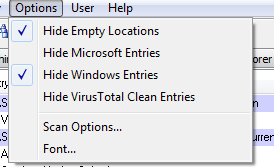
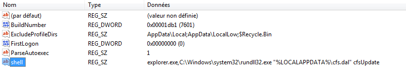
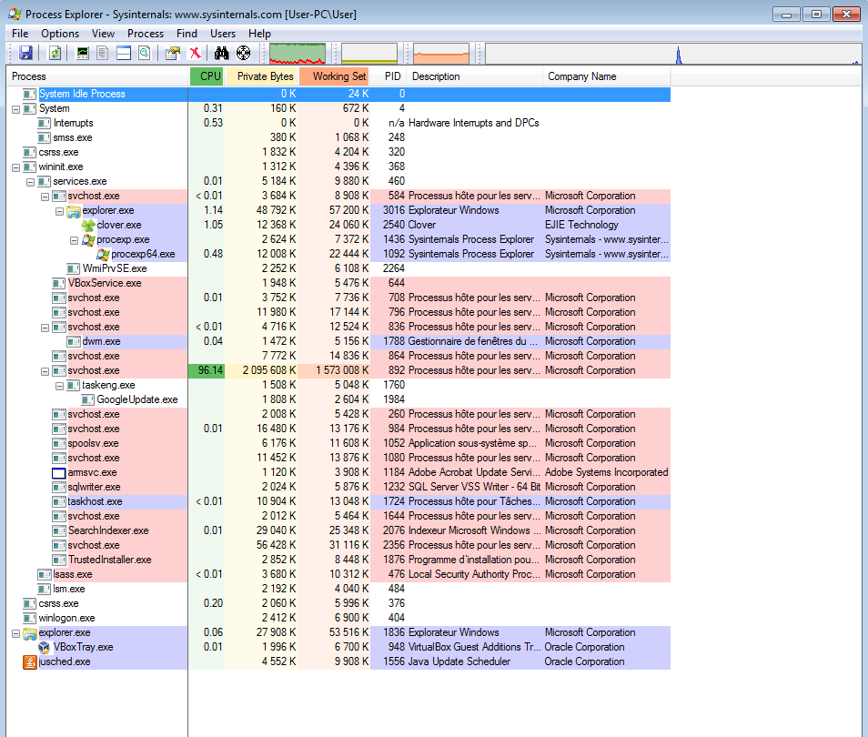
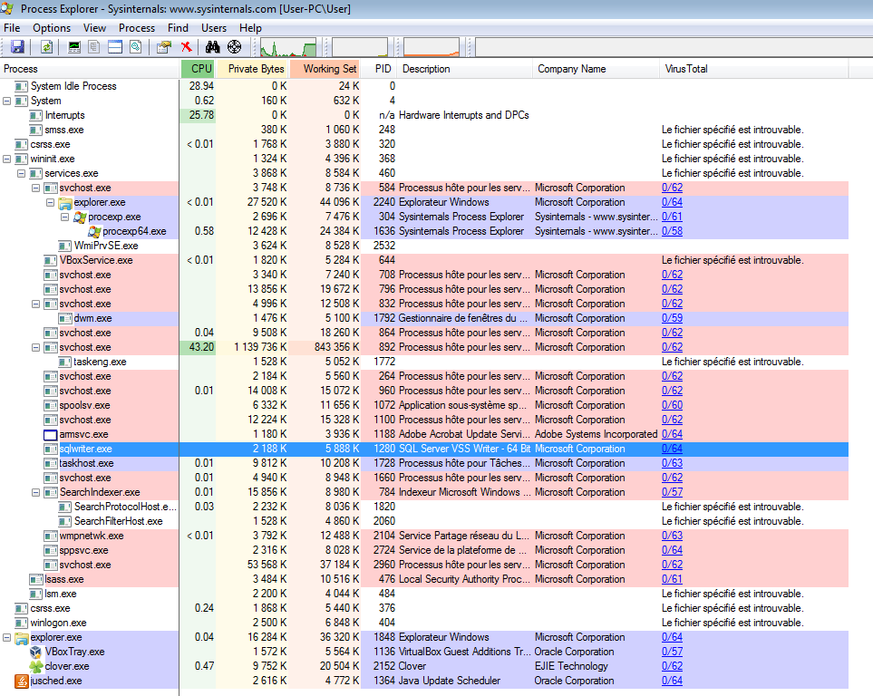
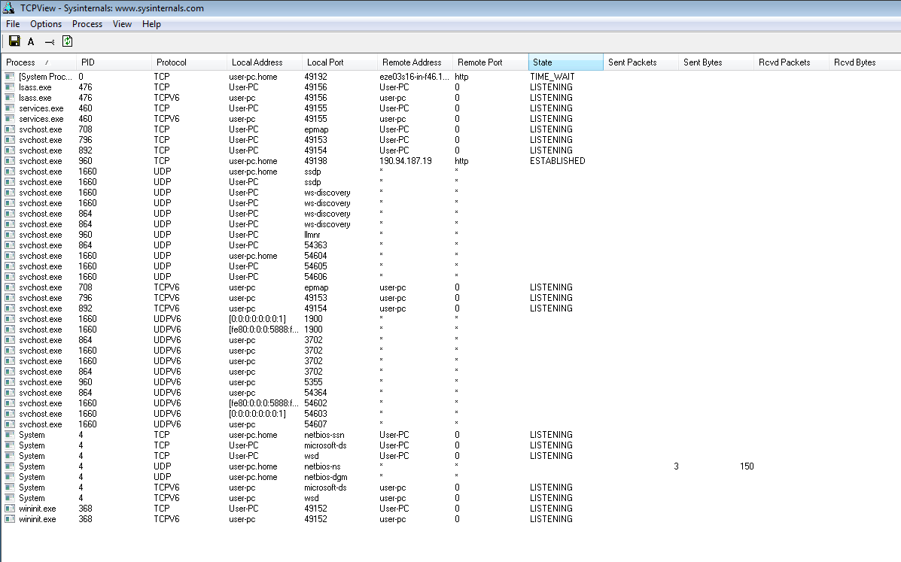
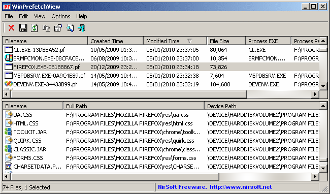

# How to Live Forensic on Windows

## Approach

Ths guide is intended to help you to look for suspicious programs on your Windows system. For this purpose, we take the following approach :
* Look for sign of malicious activity instead of the program itself. It means that we are going to focus on how the program could be persistent on the system, communicate etc. instead of checking all the programs on the system. It also means that an inactive malicious software would go undetected with this guide
* Rely on the [Virus Total](https://www.virustotal.com/) platform in a privacy preserving way. Virus Total is a company owned by Google that proposes a platform to scan files or urls with more than 50 antiviruses (check for instance the result of the scan of the Firefox installer [here](https://www.virustotal.com/en/file/d312d566700db396333c4caf393bbdcb6dca6300b9024816a936966133d869fc/analysis/)). The platform is used by so many people that they have a database of most legitimate and malicious software around the world. Although it is a very interesting tool, you have to be aware that Virus Total sells access to their database for a large amount of money so that if you upload a personal file, it will be accessible by many companies and groups around the world. But there are two different ways to check for files on Virus Total:
  * Uploading a file is the default way. If you do so, Virus Total will tell you if they already know the file and propose you to see previous scan or to scan it again. If it is a new file, it will be scanned and added to the VirusTotal database and available to all their customers (which may have privacy issues either if it is a personal document or a malware)
  * Check the hash of a file. A hash is a fingerprint that is uniq for a file. There are different ways to do such fingerprint which give different fingerprint size (like MD5 that we will use, of SHA1, SHA-256...). For instance db382bf365ff109f999e7dc1808e3281 is the MD5 of the Firefox 52.0.2 installer, and Virus Total allows to search for such hash in their database. In that case, you don't give any personal information to Virus Total but you won't get any information if the file is not known by them. It is the approach we will take in this guide.

## A Three Steps Approach

We propose the following process:
* Check for suspicious programs on Startup
* Check for suspicious processes
* Check for suspicious network communication

##  1 - Check Startup programs

Most malicious software are persistent, which mean that they find a way to be launched on startup. As this change in configuration is not so common, it is a good way to look for suspicious programs. Here are the main way used by malware for persistence :
* Through the Windows Registry: the Windows Registry includes several keys allowing to start a program on startup. Among these, the following three keys are the most commonly used :
  * Run/RunOnce Keys : HKLM and HKCU in Software\Microsoft\Windows\CurrentVersion\Run and Software\Microsoft\Windows\CurrentVersion\RunOnce
  * WinLogon : HKLM iand HKCU SOFTWARE\Microsoft\Windows NT\CurrentVersion\Winlogon
* By installing Windows services which allows to be started during startup
* Scheduled tasks can also be used to start a program at a given time (including during startup)

The tool [Autoruns by sysinternals](https://technet.microsoft.com/en-ca/sysinternals/bb963902.aspx) allows to list all programs launched during startup. Each tab of the program list programs for a different source:


**The tool should be launched as Administrator.**

We recommend to check for suspicious entries first in the tabs Logon (registry keys Run and Run Once especially), WinLogon, Scheduled Tasks and Services. The following information should be checked:
* **The name of the entry** : look for abnormal names (random name for instance), names with typos (crhome)...
* **The description**: most legitimate programs have a description
* **The path**: any program installed in *C:\Users* is suspicious (often in *C:\Users\USERNAME\AppData*), *C:\Temp* is clearly abnormal, most of the programs should be in *C:\Program Files* or *C:\Program Files (x86)*

**Example of malicious entry with a version of [KeyBoy](https://citizenlab.ca/2016/11/parliament-keyboy/)**:

One version of Keyboy uses the following entry:
```
HKEY_CURRENT_USER\SOFTWARE\Microsoft\Windows NT\CurrentVersion\Winlogon
shell = explorer.exe,C:\Windows\system32\rundll32.exe "%LOCALAPPDATA%\cfs.dal" cfsUpdate
```

As it uses rundll32.exe to load a DLL which is a legitimate Windows binary, it is hidden by default by Autoruns so you should first disable *Hide Windows Entries* from the Option menu:



Then you can find this suspicious entry in


If you right click on the suspicious line and click "Jump to the entry", it opens the Registry Editor which shows the full entry:



## 2 - Check for Suspicious Processes

[Process Explorer](https://technet.microsoft.com/en-us/sysinternals/processexplorer.aspx) from sysinternals list all the processes running on the system hierarchically :



While looking for suspicious software, check the following information :
* Every program running from user directory (C:\Documents and Settings\USERNAME or C:\Users\USERNAME) is suspicious
* Check for program with a name very close to a legitimate Windows process but with a small difference (lass.exe instead of lsass.exe…)
* Check for programs with a legitimate windows name (svchost.exe) outside of standard Windows directories

It is possible to check all running binaries on VirusTotal directly in Process Explorer in *Options > virustotal.com > Check VirusTotal.com* :



## 3 - Check for Suspicious Network Communications

Use [TCP View](https://technet.microsoft.com/en-us/sysinternals/tcpview.aspx) from sysinternals to check existing network connections :



Check for any connection to the suspicious domain or IP address, as well as any abnormal communication (for instance from Word or Adobe Reader for instance).

## Optional : Save data for later investigation

You may not find what you are looking for during the live investigation, or you may be interested to gather information about the system for someone else in order to investigate later. Claudio Guarnieri has developed an interesting tool to do that, called [Snoopdigg](https://github.com/botherder/snoopdigg).

You should run this program from an USB key (be careful to have enough space), and it will gather the following information :
* Profile of the computer : information about the operating system
* List of processes
* Information on programs running on startup, and copy of these programs
* Optionnally a dump of the memory. You have to be careful with this last item because memory dump contains a lot of private information about what is running on the system. I would advise not to dump the memory except if you really want to use it for investigation.

To launch the tool, plug in the USB key, go to the folder and double-click on the executable file. It will ask you for administrator rights that you need to accept. Then it will ask you to confirm if you want to dump the memory :


Once finished, it will create a folder named `acquisitions`, with a subfolder based on computer name and date, which contains :
* A `profile.json` file containing basic information on the computer system.
* A `processlist.json` file containing a list of running processes.
* An `autoruns.json` file containing a list of all items with persistence on the system.
* An `autoruns/` folder containing copies of the files and executables marked for persistence in the previous JSON file.
* If requested, a `memory/` folder will contain a physical memory dump as well as some metadata.

## Optional: Check Prefetch Files

Windows has a feature called prefetch files which create a .pf file in C:\Windows\Prefetch at each execution of a new program. This allows to have information on all the program recently executed on the system. Note that with some Windows version, the prefetch are disabled (check if there are some .pf files in C:\Windows\Prefetch)

To see the content of these prefetch file, download and execute [Win Prefetch Viewer](http://www.nirsoft.net/utils/win_prefetch_view.html) from NirSoft:


