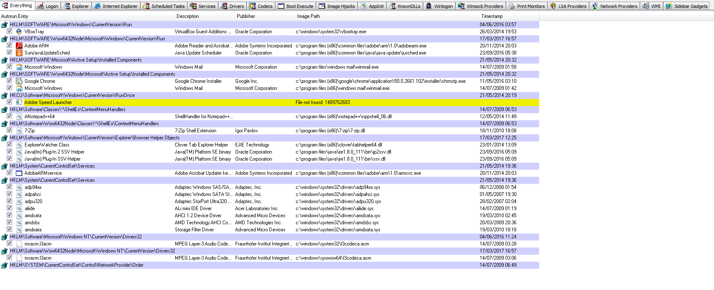

# How to Live Forensic on Windows

## Approach

Ths guide is intended to help you to look for suspicious programs on your Windows system. For this purpose, we take the following approach :
* Look for sign of malicious activity instead of the program itself. It means that we are going to focus on how the program could be persistent on the systen, communicate etc. instead of checking all the programs on the system. It also means that an inactive malicious software would go undetected with this guide
* Rely on the [Virus Total](https://www.virustotal.com/) platform in a privacy preserving way. Virus Total is a company owned by Google that proposes a platform to scan files or urls with more than 50 antiviruses (check for instance the result of the scan of the Firefox installer [here](https://www.virustotal.com/en/file/d312d566700db396333c4caf393bbdcb6dca6300b9024816a936966133d869fc/analysis/)). The platform is used by so many people that they have a database of most legitimate and malicious software around the world. Although it is a very interesting tool, you have to be aware that Virus Total sells access to their database for a large amount of money so that if you upload a personal file, it will be accessible by many companies and groups around the world. But there are two different ways to check for files on Virus Total:
  * Uploading a file is the default way. If you do so, Virus Total will tell you if they already know the file and propose you to see previous scan or to scan it again. If it is a new file, it will be scanned and added to the VirusTotal database and available to all their customers (which may have privacy issues either if it is a personal document or a malware)
  * Check the hash of a file. A hash is a fingerprint that is uniq for a file. There are different ways to do such fingerprint which give different fingerprint size (like MD5 that we will use, of SHA1, SHA-256...). For instance db382bf365ff109f999e7dc1808e3281 is the MD5 of the Firefox 52.0.2 installer, and Virus Total allows to search for such hash in their database. In that case, you don't give any personal information to Virus Total but you won't get any information if the file is not known by them. It is the approach we will take in this guide.

## Process

We propose the following process:
* Check for suspicious programs on Startup
* Check for suspicious processes
* Check for suspicious network communication

## Check Startup programs

Most malicious software are persistent, which mean that they find a way to be launched on startup. As this change in configuration is not so common, it is a good way to look for suspicious programs. Here are the main way used by malware for persistence :
* Through the Windows Registry: the Windows Registry includes several keys allowing to start a program on startup. Among these, the following three keys are the most commonly used :
  * Run/RunOnce Keys : HKLM and HKCU in Software\Microsoft\Windows\CurrentVersion\Run and Software\Microsoft\Windows\CurrentVersion\RunOnce
  * WinLogon : HiKLM SOFTWARE\Microsoft\Windows NT\CurrentVersion\Winlogon
* By installing Windows services which allows to be started during startup
* Scheduled tasks can also be used to start a program at a given time (including during startup)

The tool [Autoruns by sysinternals](https://technet.microsoft.com/en-ca/sysinternals/bb963902.aspx) allows to list all programs launched during startup. Each tab of the program list programs for a different source:

We recommend to check for suspicious entries first in the tabs Logon (registry keys Run and Run Once especially), WinLogon, Scheduled Tasks and Services. The following information should be checked:
* The name of the entry : look for abnormal names (random name for instance), names with typos (crhome)...
* The description: most legitimate programs have a description
* The path: any program installed in *C:\Users\* is suspicious (often in *C:\Users\USERNAME\AppData*), *C:\Temp* is clearly abnormal, most of the programs should be in *C:\Program Files* or *C:\Program Files (x86)*
